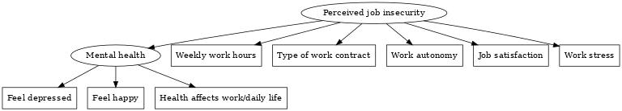

```{r setup, include=FALSE}
knitr::opts_chunk$set(warning = FALSE, message = FALSE, echo = FALSE,
                      eval = TRUE)
```

```{r packages and data, include=FALSE}
library(tidyverse)
library(lavaan)
library(gtsummary)
library(survey)
library(knitr)
library(kableExtra)
## the following package needs to be installed manually
## because it is not available on CRAN
## some other dependencies may be required, follow the instructions
library(semTable)

load("FinalResults.RData")
```

# Introduction

With rising global competition, industrial shifts, and economic recessions, an increasing number of employees face concerns about layoffs. The instability and unpredictability of labor markets impose significant psychological burdens on workers, often resulting in adverse health outcomes linked to job insecurity. Understanding the relationship between job insecurity and health is crucial for informing interventions aimed at improving workers' well-being. Previous research has established a connection between perceived job insecurity and poor health outcomes. After accounting for demographic, socioeconomic, and job characteristics, as well as prior health conditions, perceived job insecurity was found associated with deteriorating health among U.S. workers [@burgard_perceived_2009]. Similarly, McDonough [-@mcdonough_job_2000], using a national sample of Canadian adults, reported that high levels of job insecurity lead to lower self-rated health, increased psychological distress, and increased use of medication for symptom relief.

This study investigates the impact of perceived job insecurity on self-rated mental health using data from the 2021 Chinese General Social Survey (CGSS), a nationally representative sample. Employing structural equation modeling, we examine the relationship between the latent construct of perceived job insecurity and various measures of mental well-being. We hypothesize that perceived job insecurity will be negatively associated with these mental well-being indicators, suggesting potential detrimental effects of perceived job insecurity on psychological health measures. 

H1: Perceived job insecurity will be negatively associated with self-rated mental health.

H2: Perceived job insecurity will be negatively associated with self-rated mental health among different

H3: Perceived job insecurity will be negatively associated with self-rated mental health among different

# Data and Methods

## Data

CGSS

## Measures

job insecurity: how to measure, 5; 

mental health: how to measure, 3; 

control variables: which variables, 2;

## Analytical approach

model; estimator: "WLSMV", why?; which parameter (coeffient); MGA: how to do, which statistics? survey weights (we only use for descriptive as this stage)?

we treat working hours as continuous variable, and other variables as ordinal categorical variables. For those variables measuring job insecurity, the larger the value, the higher the insecurity. For those measuring mental health, the larger the value, the better the health.



# Results

Table 1 presents the weighted descriptive statistics of the variables used in the analysis. The sample consists of 993 respondents, with an average of 49.92 weekly work hours. A small proportion of respondents have an indefinite term work contract, while the majority have a fixed-term contract. Most respondents report that they have mainly control over their work and are satisfied with their jobs. The majority of respondents report that they rarely or sometimes experience work stress. Regarding mental health, most respondents report that they rarely or sometimes feel depressed and often or always feel happy. The majority of respondents indicate that their health never affects their work or daily life. The sample is almost evenly split by sex, with around 86% of respondents not being members of the Chinese Communist Party (CCP).

\singlespacing
```{r descriptive statistics, results='asis'}
CGSS2 = CGSS %>% 
  mutate(workhours = as.numeric(workhours),
         workcontract = as.factor(workcontract),
         workself = as.factor(workself),
         satisfaction = as.factor(satisfaction),
         workstress = as.factor(workstress),
         depressed = as.factor(depressed),
         happy = as.factor(happy),
         health = as.factor(health),
         sex = as.factor(sex),
         party = as.factor(party)) %>% 
  mutate(workcontract = recode(workcontract, 
                          "1" = "Infinite term", 
                          "2" = "Fixed term", 
                          "3" = "No contract"),
         workself = recode(workself, "1" = "Completely controlled by self",
                            "2" = "Mainly controlled by self",
                            "3" = "Mainly controlled by others",
                            "4" = "Completely controlled by others"),
         satisfaction = recode(satisfaction, "1" = "Very satisfied", 
                               "2" = "Satisfied", 
                               "3" = "Neutral", 
                               "4" = "Dissatisfied", 
                               "5" = "Very dissatisfied"),
         workstress = recode(workstress, "1" = "Rarely", 
                             "2" = "Sometimes", 
                             "3" = "Often", 
                             "4" = "Always"),
         depressed = recode(depressed, "1" = "Always", 
                            "2" = "Often", 
                            "3" = "Sometimes", 
                            "4" = "Rarely", 
                            "5" = "Never"),
         happy = recode(happy, "1" = "Never", 
                        "2" = "Rarely", 
                        "3" = "Sometimes", 
                        "4" = "Often", 
                        "5" = "Always"),
         health = recode(health, "1" = "Always", 
                         "2" = "Often", 
                         "3" = "Sometimes", 
                         "4" = "Rarely",
                         "5" = "Never"))

design = svydesign(id = ~1, weights = ~weight, data = CGSS2)

descriptive = design %>% 
  tbl_svysummary(
    include = c(workhours, workcontract, workself, satisfaction, 
                workstress, depressed, happy, health, sex, party),
    digits = list(all_continuous() ~ 2, all_categorical() ~ 1),
    statistic = list(all_continuous() ~ "{mean} ({sd})",
                     all_categorical() ~ "{p}%"),
    type = list(workhours ~ "continuous",
                c(workcontract, workself, satisfaction, workstress, depressed, happy, health, sex, party) ~ "categorical"),
    label = list(
      workhours = "Weekly work hours",
      workcontract = "Type of work contract",
      workself = "Work autonomy",
      satisfaction = "Job satisfaction",
      workstress = "Work stress",
      depressed = "Feel depressed",
      happy = "Feel happy",
      health = "Health affects work/daily life",
      sex = "Sex",
      party = "Party membership"
  ) 
) %>% 
  modify_header(
    label ~ "**Variable**",
    all_stat_cols() ~ "Mean (SD) / Percent") %>% 
  modify_footnote(everything() ~ NA) %>% 
  modify_caption("Weighted descriptive statistics (N = 993)") %>%
  bold_labels()

as_kable_extra(descriptive, format = "latex", booktabs = TRUE, longtable = TRUE)
```
\doublespacing

Table 2 presents the results of the structural equation model examining the relationship between perceived job insecurity and mental health, using WLSMV estimation. The model exhibits a Comparative Fit Index (CFI) of 0.94 and a Root Mean Square Error of Approximation (RMSEA) of 0.07, both of which are considered acceptable. For the measurement models, all factor loadings for the latent variable mental health are significant at the 0.01 level, while three out of four factor loadings are significant for the latent variable perceived job insecurity at the 0.1 level. The analysis reveals that perceived job insecurity negatively affects mental health, with a coefficient of -0.11 at the 0.01 significance level. In essence, higher perceived job insecurity correlates with poorer mental health, thereby supporting H1.

\singlespacing
```{r H1 result, results='asis'}
semTable(
  object = c(" " = fit1),
  type = "latex",
  longtable = TRUE,
  paramSets = c("loadings", "slopes", "fits"),
  caption = "Structural equation model results for the
         relationship between perceived job insecurity and mental
         health",
  varLabels = c(
    "insecurity" = "Perceived job insecurity",
    "mental" = "Mental health",
    "workhours" = "Weekly work hours",
    "workcontract" = "Type of work contract",
    "workself" = "Work autonomy",
    "satisfaction" = "Job satisfaction",
    "workstress" = "Work stress",
    "depressed" = "Feel depressed",
    "happy" = "Feel happy",
    "health" = "Health affects work/daily life"
  ),
  fits = c("chisq", "cfi", "tli", "rmsea")
)
```
\doublespacing

Table 3 illustrates the results of the structural equation model that separately evaluates males and females without constraints. This model has a CFI of 0.93 and an RMSEA of 0.07, suggesting an acceptable fit. The findings indicate that perceived job insecurity adversely impacts mental health for both genders. However, the effect is more pronounced for females, with a coefficient of -0.15, compared to males, who have a coefficient of -0.10. To assess whether the relationship between perceived job insecurity and mental health is invariant between males and females, a constrained model equalizing the structural coefficients was tested. Table 4 details the results of the constrained model, which maintains the same CFI of 0.93 and RMSEA of 0.07 as the unconstrained model. Nonetheless, the chi-square test reveals that the constrained model fits significantly worse than the unconstrained model, indicating that the relationship is not invariant across genders. Therefore, females experience a more severe mental health decline due to perceived job insecurity, thus supporting H2.

\singlespacing
```{r H2 result unconstrained, results='asis'}
semTable(
  object = c(" " = fit2_sex),
  type = "latex",
  longtable = TRUE,
  paramSets = c("loadings", "slopes", "fits"),
  caption = "Perceived job insecurity and mental
         health among different sex categories without constraints",
  columns = c("eststars", "se"),
  alpha = c(0.1, 0.05, 0.01),
  varLabels = c(
    "insecurity" = "Perceived job insecurity",
    "mental" = "Mental health",
    "workhours" = "Weekly work hours",
    "workcontract" = "Type of work contract",
    "workself" = "Work autonomy",
    "satisfaction" = "Job satisfaction",
    "workstress" = "Work stress",
    "depressed" = "Feel depressed",
    "happy" = "Feel happy",
    "health" = "Health affects work/daily life"
  )
)
```

```{r H2 result constrained, results='asis'}
semTable(
  object = c(" " = fit2_sex_coef),
  type = "latex",
  longtable = TRUE,
  paramSets = c("loadings", "slopes", "fits"),
  caption = "Perceived job insecurity and mental
         health among different sex categories without constraints",
  columns = c("eststars", "se"),
  alpha = c(0.1, 0.05, 0.01),
  varLabels = c(
    "insecurity" = "Perceived job insecurity",
    "mental" = "Mental health",
    "workhours" = "Weekly work hours",
    "workcontract" = "Type of work contract",
    "workself" = "Work autonomy",
    "satisfaction" = "Job satisfaction",
    "workstress" = "Work stress",
    "depressed" = "Feel depressed",
    "happy" = "Feel happy",
    "health" = "Health affects work/daily life"
  )
)
```
\doublespacing

The relationship between perceived job insecurity and mental health is further analyzed among CCP and non-CCP residents. Table 5 provides the results of the structural equation model for these groups without any constraints. The model reports a CFI of 0.93 and an RMSEA of 0.07, signifying a good fit. The analysis shows that perceived job insecurity has a significantly negative effect on mental health for both CCP and non-CCP residents. However, the negative impact is stronger for non-CCP residents, with a coefficient of -0.12, compared to CCP residents, who have a coefficient of -0.05. To determine whether this relationship is invariant between CCP and non-CCP residents, a constrained model equalizing the structural coefficients was tested. Table 6 presents the results of the constrained model, which also maintains the same CFI of 0.93 and RMSEA of 0.07 as the unconstrained model. However, the chi-square test indicates that the constrained model is significantly worse than the unconstrained model, suggesting that the relationship is not invariant between the two groups. Consequently, non-CCP residents experience a more pronounced decline in mental health due to perceived job insecurity, thereby supporting H3.

\singlespacing
```{r H3 results unconstrained, results='asis'}
semTable(
  object = c(" " = fit3_party),
  type = "latex",
  longtable = TRUE,
  paramSets = c("loadings", "slopes", "fits"),
  caption = "Perceived job insecurity and mental
         health among different sex categories without constraints",
  columns = c("eststars", "se"),
  alpha = c(0.1, 0.05, 0.01),
  varLabels = c(
    "insecurity" = "Perceived job insecurity",
    "mental" = "Mental health",
    "workhours" = "Weekly work hours",
    "workcontract" = "Type of work contract",
    "workself" = "Work autonomy",
    "satisfaction" = "Job satisfaction",
    "workstress" = "Work stress",
    "depressed" = "Feel depressed",
    "happy" = "Feel happy",
    "health" = "Health affects work/daily life"
  )
)
```

```{r H3 results constrained, results='asis'}
semTable(
  object = c(" " = fit3_party_coef),
  type = "latex",
  longtable = TRUE,
  paramSets = c("loadings", "slopes", "fits"),
  caption = "Perceived job insecurity and mental
         health among different sex categories without constraints",
  columns = c("eststars", "se"),
  alpha = c(0.1, 0.05, 0.01),
  varLabels = c(
    "insecurity" = "Perceived job insecurity",
    "mental" = "Mental health",
    "workhours" = "Weekly work hours",
    "workcontract" = "Type of work contract",
    "workself" = "Work autonomy",
    "satisfaction" = "Job satisfaction",
    "workstress" = "Work stress",
    "depressed" = "Feel depressed",
    "happy" = "Feel happy",
    "health" = "Health affects work/daily life"
  )
)
```
\doublespacing

# Further steps

- we haven't used survey weights for SEM analysis, but we are still trying to find the package that can handle this

- we will continue enhancing current writing and analysis

# Appendix

See more infomation on GitHub: https://github.com/petertbz/SurvMeth687Project

# References


